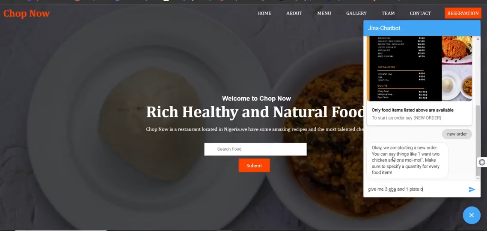
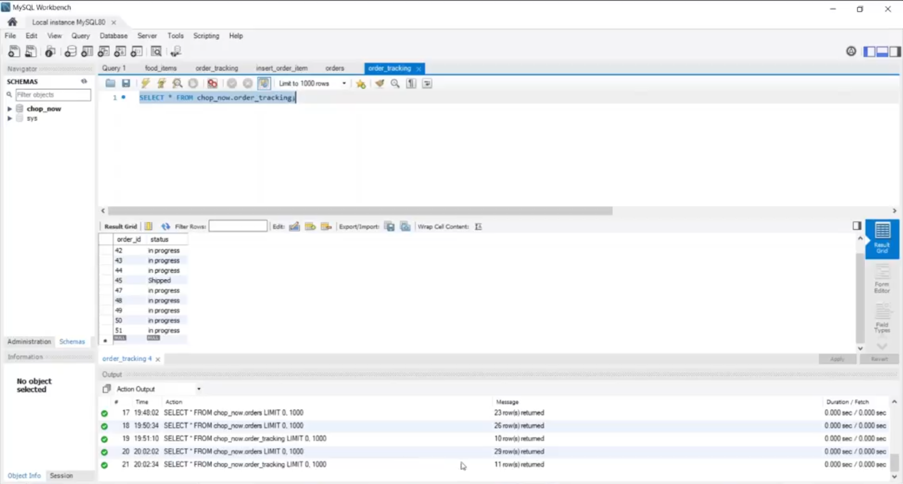
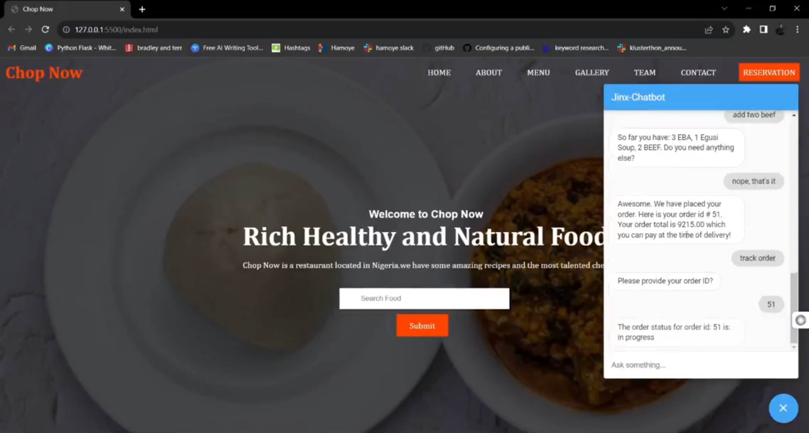

# *Jinx*: Chop Now Restaurant Chatbot

## Overview
This project implements a chatbot(*Jinx*) for *Chop Now*, an hypothetical restaurant located in Lagos, Nigeria. The chatbot is designed to assist users in placing new food orders, tracking existing orders, and answering queries. Built using **Dialogflow** for natural language processing, **FastAPI** for backend services, and **MySQL** for data storage, this project demonstrates an end-to-end solution for an AI-driven customer service system.

The bot supports both **English** and **Pidgin**, catering to local Nigerian users, making it more accessible and engaging.



## Demo
Watch the demo of the chatbot in action <a href="https://drive.google.com/file/d/1_5KhsUQT0b0JDWen8TSUBHgxEi6Na5ba/view?usp=sharing" target="_blank">here</a>.

## Problem Statement
*Jinx* aims to enhance its customer service by providing an easy-to-use chatbot that allows users to:
- Place food orders through natural conversations.
- Track their order statuses without needing to call customer support.
- Get immediate responses to FAQs, such as menu options and restaurant location.

## Architecture
The system architecture can be broken down into several components:

1. **Dialogflow**: 
   - Handles natural language understanding (NLU) and processes user intents such as placing or tracking orders.
   - Manages conversational context, enabling the bot to provide relevant responses based on user history.

2. **FastAPI Backend**: 
   - Acts as a middleman between Dialogflow and the MySQL database.
   - Receives user inputs (order details, queries) from Dialogflow and processes them, interacting with the database to store or retrieve information.

3. **MySQL Database**: 
   - Stores customer orders, menu items, and other relevant data.
   - The backend fetches data for order tracking or new orders and updates the database accordingly.

4. **Ngrok**: 
   - Facilitates secure HTTPS tunneling to expose the local FastAPI server to the web for testing with Dialogflow.

## Project Structure
```graphql
├── backend/                  # Contains FastAPI backend code
│   ├── main.py               # FastAPI entry point
│   └── requirements.txt      # Backend dependencies
├── db/                       # Contains MySQL database dump
│   └── chopnow_db.sql        # Database dump file
├── dialogflow_assets/         # Dialogflow training phrases, intents, etc.
└── README.md                 # Project documentation
└── food list.png              #png file was uploaded to a google drive and then linked in dialogflow
```

## Features
- **New Order**: Users can place food orders by selecting from a predefined menu.
- **Order Tracking**: Users can track their order status using an order ID.
- **Language Support**: The chatbot supports both English and Nigerian Pidgin, providing localized conversations for users.
- **Menu Querying**: The chatbot allows users to inquire about the menu and dish availability.

## Installation

### Prerequisites
- Python 
- MySQL server
- Dialogflow (Google Cloud)
- Ngrok (for local testing)
- mysql-connector-python
- fastapi[all]

## Usage
- Open Dialogflow and start a conversation with the chatbot to test intents such as placing an order or tracking an existing one.
- You can also interact with the FastAPI backend directly by making requests to the API endpoints exposed by the server.

## Key Learnings
This project demonstrates the integration of multiple technologies to build a complete chatbot system:
- **Dialogflow** for natural language understanding and intent recognition.
- **FastAPI** for a lightweight, fast backend service.
- **MySQL** for efficient data storage and retrieval.
- **Ngrok** for local development.

## Future Enhancements
- **Payment Integration**: Add support for online payments via the chatbot.
- **Multiple Language Support**: Extend support for more Nigerian languages.
- **Extended Order Features**: Enable users to modify or cancel their orders.




